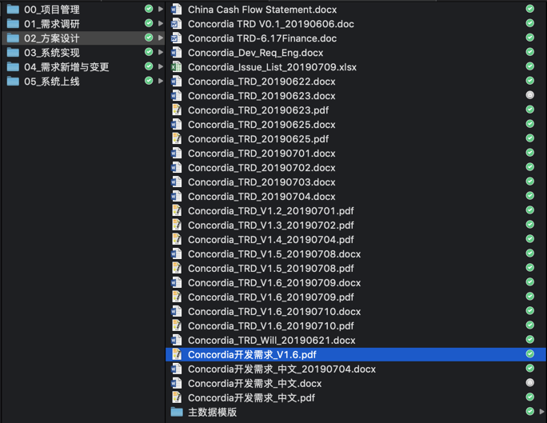

# 办公文档也需要版本管理

通常来讲，只有管理代码的时候，才会想到使用Git。直到在网上看到一个作者，他日常需要处理各种办公文档，将Git作为文档版本管理工具。我才意识到，自己低估了Git在日常工作中的使用价值。

尤其是当我看到这样的文件夹出现在项目当中时，更是无法忍受。

# 项目协作时更需要版本管理

当撰写项目中的文档时，更需要版本管理软件。

想像一下，项目组中的3个人需要同时修改某份文件，每个人修改的部分都不一样。我们现在的操作方式是，一个人先修改，保存之后第二个人进行修改，最后第三个人最后修改。本来可以并行的工作，一定要搞成串行，时间利用率真的很差。

需求文档和解决方案，会经常根据客户要求进行修改。每次修改后，都要建立一个新的版本，但是各个版本之间的差异是什么，却不知道。如果能够看到差异，我们就能看到方案是如何进行演化和优化的。对于一些创造性的方案来讲，更是有学习的意义。

尤其是开发的需求方案。跟客户讨论的时候，会修改多次。等到客户签字确认后，与开发讨论的时候，还会修改多次。如果每修改一次，都要从头到尾看一遍的话，多抓狂。如果每次都用颜色或备注做标记的话，最后就变成五颜六色的文档了。

# 如何使用

不管什么文档，都可以使用Git来进行版本管理。

为了更好地查看差异，我建议使用Markdown格式来保存文件。即使需要其他格式，也能很方便地进行转换。

使用OFFICE格式进行保存，一个缺点是文件太大，另外一个是格式太多，导致无法看到文件版本之间的差异。

# 学习资料

关于Git的使用方法，网络上已经有完整且丰富的资料，我们直接拿来学习即可。

[git - the simple guide](http://rogerdudler.github.io/git-guide/)
一个快速的入门指南，有图示，容易理解。

[A Visual Git Reference](http://marklodato.github.io/visual-git-guide/index-en.html)
图解加上详细的解释，学会之后应该可以满足日常的工作需要了。

 [Think Like (a) Git](http://think-like-a-git.net/)
增加了一些原理性的内容，有利于深入理解Git。

[Git 菜单](https://geeeeeeeeek.github.io/git-recipes/)是一份综合的社区文档。其中的很多文章是翻译而来的，如果喜欢直接阅读英文，可以点击原文链接。相对于译文，我就倾向于阅读原文。

[Oh shit, git!](http://ohshitgit.com/)
作者列出了日常生活中经常会遇到的一些问题。

