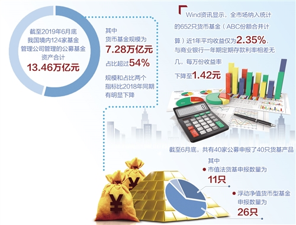
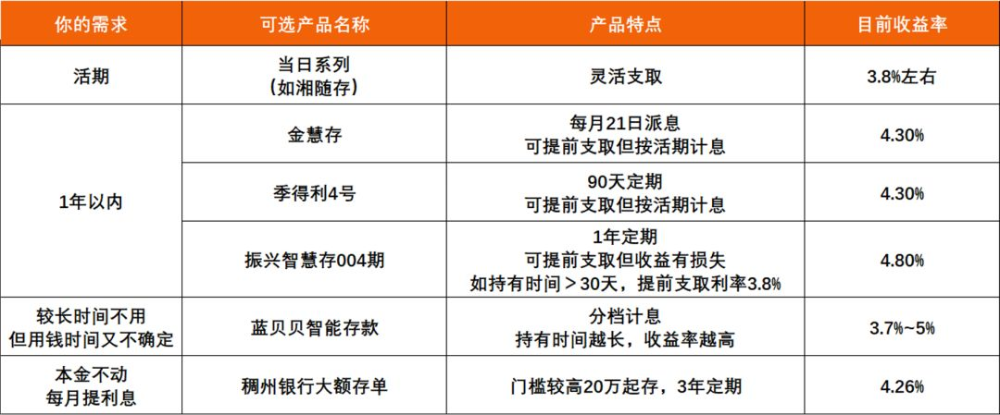

[TOC]

# 序言

投资体系的建立需要两个方面，一是武器库，二是知道何时使用何种武器。

武器库就是我们投资的品种，例如常见的股票和基金。我们想知道在市场环境发生变化时，应该使用投资何种产品，首先必须熟悉这些产品的特性，才能把它们转化成称手的兵器。想一想那金箍棒，放在东海龙王的后院里，只是一根生锈的铁棒子而已，到了齐天大圣手里，才变成如意金箍棒。东西没变，只是使用的人变了，就产生了不一样的效果。

这个系列，就是介绍各种投资品种以及它们的特点，就像古龙的七种武器一样。我搞清楚一个投资品种后，就写一个，这样能够加深自己的理解。指数基金会是我接下来很长一段时间内的投资主力，会另外写一个系列。

# 1. 现金管理

## 1.1 货币基金

这类产品，经过余额宝的普及，大家都已经很熟悉了。它作为我们日常备用金的管理工具，是很方便的。虽然收益率低，目前只有2-3%。可是，它的流动性好，仅次于现金。这是它最大的优点。

货币基金分为A类和B类。我们平常投资的是A类。B类的起购门槛很高，500万起，一般只有机构才会投资。现在有些销售平台，例如天天基金，将这些B类货基拆开了卖，普通人也可以进行投资。B类的收益率比A类略高，主要原因是它的销售服务费更低一些。因为不管是A类还是B类，它们投资的去向都是一样的。

在中国证监会发布的《货币市场基金监督管理办法》（征求意见稿）中，规定了货币基金的投资范围为：

> （一）现金；
>
> （二）期限在一年以内（含一年）的银行存款、债券回购、中央银行票据、同业存单；
>
> （三）剩余期限在三百九十七天以内（含三百九十七天） 的债券、非金融企业债务融资工具、资产支持证券；
>
> （四）中国证监会、中国人民银行认可的其他具有良好流动性的货币市场工具。

从上面的投资范围看，货币基金的安全性极高，风险极低。也正是因为如此，它的收益率才如此低。实际上，在美国等成熟市场，货币基金的收益率只有1-2%。

我们通过支付宝、微信、第3方基金销售平台、银行APP，都可以购买此类产品。申购和赎回时，我们不用支付费用，但是要支付每天的销售服务费。这个费用我们平时没有注意到，是因为在公布基金净值时，已经将这些费用扣除了。

很多货币基金在T+0赎回时，有1万元的上限，这点需要注意。如果实时赎回金额超过1万元，我们可以购买多支货币基金。

我在查阅资料的时候，发现根据Wind资讯显示，截止2019年6月底，货币基金占比超过54%，虽然相比2018年有所下降，我觉得还是过高。大家还是应该在把大部分的资产放在收益更高的品种上才是。

## 1.2 银行理财

银行发布的理财产品，通常收益率在4%左右。有的平台购买的时候有起购门槛，像且慢上的，通常需要5万元起购。在支付宝上的，起购的金额比较低，也方便我们定投。

银行理财，相对于货币基金，收益高一些，流动性就差一点。我们可以根据自己对于流动性的需求，选择不同的期限。我的一些朋友，在买房前，就会用首付款购买银行理财产品，赚取一点收益。

有些银行理财产品，像沈大推荐的招行朝招金（金元进取型）-8199，就可以随时赎回，但是每天有5万元的限额。它的预计年化收益率为3.39%，在收益和流动性中取得了不错的平衡。不过，在购买前，需要本人到招行网点，去做风险评估。这款产品需要在招行APP上购买，我在尝试的时候，发现有购买额度限制，看来人气很高啊。

## 1.3 银行创新存款

这是我从《简七理财》的公众号中了解到的产品。下面是关于银行创新存款的简单说明：

>\- **发行方：银行**
>
>投资创新型存款产品，本质上，就是你在该银行存了一笔定期存款。
>
>**-收益来源：存款利率**
>
>中小银行资金缺口大，愿意给出更高的存款利率。一般5年期的定期存款，收益率可达5%左右。
>
>**- 可提前支取的原因：“转让收益权”**
>
>产品通过“转让”的方式，将定期存款，变成可灵活支取的产品。这让我们能用更短的期限（如1年/6/3个月甚至灵活取现），享受到长期存款的高收益。

它上面有详细的介绍，可点击链接，[创新型存款产品的介绍及购买](https://mp.weixin.qq.com/s?__biz=MjM5MzA3MjI2NQ==&mid=503140590&idx=4&sn=22b2e8dab2bf27df0662b60df9a0cd4f&key=10772accce8b46692524982f779323c8c252ddb800e0f3b57ce251c726fa07d199f41b986b2be1940af6d3bf1dd1604b4f3bc4e368b3c17543b2f1e26f0fb71f2645f7fdbbbfc09012e407a8c5e14387&ascene=0&uin=MTMwNjQ2NzIyOA%3D%3D&devicetype=iMac+MacBookPro14%2C2+OSX+OSX+10.14.6+build(18G87)&version=12031a10&nettype=WIFI&lang=en&fontScale=100&pass_ticket=vBaFYAltacxlNucuUT07j%2FTvCfKP23YBS%2BIlvbJQlKu7LpK%2BzObmJvr4gzwMCRob##)。

简七理财在另一篇文章[分享5款低风险、好收益的投资 | 别只盯着余额宝](https://mp.weixin.qq.com/s?__biz=MjM5MzA3MjI2NQ==&mid=2650624186&idx=1&sn=df0ae8c096c2a16b6f7baeb61897c03d&chksm=be95655c89e2ec4a0d1c0d7de1a2e6b29540d9c12e25f3064405ae62de2360babf34c9a7c72e&scene=38&key=0f0abb20a7092e0c2d7455e400b0f90959759864be85ef89e55113bc1261dbdc1a09c78109dbe2481cdd1a61cd05fc319c6a17a2bef5af8a38b5ec6a1b02954c6db12f3806fca4182e78ce9847b9b484&ascene=0&uin=MTMwNjQ2NzIyOA%3D%3D&devicetype=iMac+MacBookPro14%2C2+OSX+OSX+10.14.6+build(18G87)&version=12031a10&nettype=WIFI&lang=en&fontScale=100&pass_ticket=vBaFYAltacxlNucuUT07j%2FTvCfKP23YBS%2BIlvbJQlKu7LpK%2BzObmJvr4gzwMCRob##)中根据投资期限，给大家做了更详细的介绍。不想看文章的可以直接看图：

# 2. 中短期产品

## 2.1 债券和债券基金

债券，在我看来，就像民间借贷一样，债主借出钱，借钱的在约定时间，连本带息一起还掉。民间借贷时，我们更多的是依靠人们之间原始的信赖。一旦到了正规的交易市场，这些信任关系就需要受到法律的保护，因为借款人与债权人之间可能之前从来没有过交集。

发债的主体，可以是政府、企业或金融机构。根据借款周期的长短，利率也会有高有低。通常情况下来讲，周期越长，利率越高；周期越短，利率越低。这点也好理解，毕竟借款周期越长，风险越大，要求的回报自然也就越高。如果出现债券利率倒挂的现象，往往表明经济出现了问题。例如，19年8月，美国长期国债利率，低于短期国债利率，就被认为美国经济出现衰退的前兆。因为大家对于未来的经济前景感到悲观，所以都只愿意投资短期债券或是现金类产品，而不愿意进行长期投资。这只是我目前粗浅的理解，以后要定一份更详尽的文章。

债券通常是在金融机构间进行流转，个人投资者通常很难参与。债券基金是我们这些个人投资者参与的好工具，但是我们还是要了解债券的特点，才能根据自己的风险承受能力和市场环境，选择合适的债券基金。

债券价格与利率的关系，我一直不理解，要请教一下高手才行。

> 市场风险是指债券的市场价格随资本市场的利率上涨而下跌，因为债券的价格是与市场利率呈反方向变动的。当利率下跌时，债券的市场价格便上涨；而当利率上升时，债券的市场价格就下跌。而债券距离到期日越远，其价格受利率变动的影响越大。

我今天的理解是，市场利率上升时，现有债券的票面收益率会下降，这样投资者会去购买高利率的债券或是其他更高收益的产品。这个时候，债券的市场价格就会下降。反之，如果市场利率降低，那么投资者就会抢购现有的高利率债券，从而推高现有债券的市场价格。这一点暂时说服了我自己，还需要验证。

沈潜在一篇他的文章中，详细介绍了债券基金，我觉得很全面，让人受益匪浅，就在这里转载了。

[【长文】债券基金投资指南（修正版）](https://mp.weixin.qq.com/s?src=11&timestamp=1567555686&ver=1831&signature=DAhOwoiRm**dxs-GMnQTksFoL5ey8e1tJZSqN12VABx48AaPDKGdgcZAgglEkix0CzI2VtzpOuekldBjLAJ5XkaPjeu*VNMsPtL-dY5IpFCHB1jU8rl629J-a6Suj0nG&new=1)

[【重磅专题|华泰固收】固收分析框架之债券策略篇](https://mp.weixin.qq.com/s?__biz=MzU3MDY3NTU3Nw==&mid=2247491876&idx=1&sn=b11f287aec0501b60d516866985bd962&scene=21#wechat_redirect)

我之前低估了投资债券需要的能力，沈潜讲过，E大在2019年中秋的推送中也讲过这么一段。

> 不必看太多宏观经济数据，因为只有资本市场才是最敏感最领先的指标。股票先于宏观数据，而债券又会先于股票。这是因为做股票的人非常敏感，而做债券的人更敏感。

## 2.2 战略配售基金

2019年3月29日 - [【实盘记录】买入场内配售基金](https://mp.weixin.qq.com/s?__biz=MzIwNzM0NTgzMw==&mid=2247487675&idx=1&sn=2502774a3fe81ff5519a398aae354cc2&chksm=9712917da065186ba101d1c5133599f5f5a9801f47c4d661762ac5d3b97a1d3cc7d91c961452&scene=21#wechat_redirect)

2019年4月6日 - [再谈战略配售基金](https://mp.weixin.qq.com/s?__biz=MzIwNzM0NTgzMw==&mid=2247487727&idx=1&sn=dcc533bc35a464155d8c0db7e3068407&chksm=97129129a065183f414a00d457dcbf6373e69fecf2d76a8d532a170b60381e34c0a17d26e412&scene=21#wechat_redirect)

2019年4月15日 - [逆势上涨，这个品种还能买吗？ | 4月15日投资笔记](https://mp.weixin.qq.com/s?__biz=MzIwNzM0NTgzMw==&mid=2247487806&idx=1&sn=fa8453351bf37c81aab8df544dafc753&chksm=971290f8a06519ee4233abdd8ebc21f1b6fdc7e02308c74c353571b9b6a6b37f3046825a56ed&scene=21#wechat_redirect)

2019年4月22日 - [这个品种，先别追了 | 4月22日投资笔记](https://mp.weixin.qq.com/s?__biz=MzIwNzM0NTgzMw==&mid=2247487866&idx=1&sn=ff29ddfdc6d97200fbdc3080de8bdfb7&chksm=971290bca06519aae43b6e43fe913ae99f88627adfd25ef147ce001b0f73fb18385bf1826459&scene=21#wechat_redirect)

> 投资就是这样奇妙，当我们将收益预期降低时，实际收益很可能会高起来。
>
> 在每个时间段内，肯定会有一个风险收益比最佳的投资品种在等着我们，我们只需耐心寻找即可，总会找到的，一切都不着急，慢慢来。

2019年5月26日 - [这个品种，再次进入买入区 | 5月26日投资笔记](https://mp.weixin.qq.com/s?__biz=MzIwNzM0NTgzMw==&mid=2247488132&idx=1&sn=1eab1975fa4276f648bfcbe028a85070&chksm=97129342a0651a545c287cc7ad21f49447d95f92f2e241df89127457c45c16ddc70c96b4499a&scene=21#wechat_redirect)

2019年5月28日 - [自己动手，怎样做一个保本升值的投资组合？（一）](https://mp.weixin.qq.com/s?__biz=MzIwNzM0NTgzMw==&mid=2247488145&idx=1&sn=a4201db7f33222cd98254f7b5f493f6f&chksm=97129357a0651a4140be82c65d370111a0449ff1711850f2e88cf4897f0a8a4071a7c7dd6bd9&scene=21#wechat_redirect)

## 2.3 长江电力

2019年5月29日 - [自己动手，怎样做一个保本升值的投资组合？（二）](https://mp.weixin.qq.com/s?__biz=MzIwNzM0NTgzMw==&mid=2247488154&idx=2&sn=86e627efa4c2fb53ee1c8cc3719062d5&chksm=9712935ca0651a4a7df3ca0603431d5572c007ad7935629b5e47fae8ed3c21b666a81d53272f&scene=21#wechat_redirect)

> 长江电力虽是股票，但更像是一只债券，甚至可以说，不是债券，胜似债券。
>
> 永续经营，业绩稳定，现金流充沛，分红明确，这让长江电力像极了一只优质债券。
>
> 更难能可贵的是，长江电力将自己每年的分红下限，在自己的公司章程中明确写清：
>
> 2016 年至2020年，每年每股分红不低于0.65元；2021年至2025 年，每年的分红金额，不低于当年实现净利润的70% 。
>
> 我看过非常非常非常非常非常多的公司，但像长江电力这样，不加前置条件，就明明白白把自己的分红下限，写清楚的公司，我目前在A股还没找到第二家。
>
> 在这个频繁暴雷的时代，长江电力这样的资产，真是太稀缺了。
>
> 这也吸引了大批的投资机构，目前长江电力的股东中80%以上，都是保险等机构。

沈潜建议的买入价格是17.71以下，我按0.65的分红来计算，股息率为3.67%，还算正常。因为今年涨的比较多，我想等一等，看看国庆后的行情如何。拿最低价格13.6，和17.71做个加权平均，在15.65元左右的时候入手，看看市场是否给机会了。除权之后，沈潜将买入价格调整到了17元，我就继续筹钱持币等待吧。

更详细的，可以看沈潜的这两篇文章。

[长江电力投资指南
](http://mp.weixin.qq.com/s?__biz=MzIwNzM0NTgzMw==&mid=2247488154&idx=2&sn=86e627efa4c2fb53ee1c8cc3719062d5&chksm=9712935ca0651a4a7df3ca0603431d5572c007ad7935629b5e47fae8ed3c21b666a81d53272f&scene=21#wechat_redirect)

[长江电力的定价逻辑](http://mp.weixin.qq.com/s?__biz=MzIwNzM0NTgzMw==&mid=2247488389&idx=1&sn=568fbd284045d4d745935746eb9a8c1f&chksm=97129243a0651b55f71add37ac8e69d74faff803a89bd0654581bdbf99104d8abca80d374dfe&scene=21#wechat_redirect)

## 3.1 基金

[多多投资计划](https://mp.weixin.qq.com/s?__biz=MzIwNzM0NTgzMw==&mid=2247484540&idx=3&sn=4314c0101c1170e72e9e5ba2b713cfac&chksm=971285baa0650cacad3c842e041eb9dae1ea1264ece5707c505ccd7a1d784b33271cc5accaad&scene=21#wechat_redirect)

[4月2日投资笔记](https://mp.weixin.qq.com/s?__biz=MzIwNzM0NTgzMw==&mid=2247485307&idx=1&sn=f128afdcb2ed9dbb4cd5225ffe0c44c4&chksm=971286bda0650fab45851b7f7ec47582df7f4ae71500846d055dc5410b33e3ac2c0cae86d59e&scene=21#wechat_redirect)

[【长文】我的基金投资方法论](https://mp.weixin.qq.com/s?__biz=MzIwNzM0NTgzMw==&mid=2247483721&idx=1&sn=ee712d0b53eb1c177bb0171e58d628c5&scene=19#wechat_redirect)

[优质资产清单（股权部分）](https://mp.weixin.qq.com/s?__biz=MzIwNzM0NTgzMw==&mid=2247486230&idx=1&sn=2579c842823a28ebe4b493083411f956&scene=19#wechat_redirect)

看指数时，不一定要排队那些金融和保险行业占比高的。我要先查一下，金融和保险行业在整个市场中的比例。我要先确定下整个市场下，金融行业的占比。再来看300个，100，甚至50。

沈潜比较关注的有深证红利、易方达上证50增强和汇丰晋信行业龙头，其中选择上证50增强，就是因为指数本身的行业结构不合理，需要基金经理进行调整。

对于中概互联，沈潜建议在1.3元以下定投。

基金的分类方式有很多种，包括按投资标的、管理方式、是否公开等。

关于为什么选择股票和股票型基金作为主力，参考《股市长线法宝》中的图片，显示各种投资品种的长期收益。

##### 3.1.1.1 投资标的

**货币基金**

货币基金的投资对象是短期借款和债券。这些短期借款和债券的对象通常是银行，需要的金额是极大的。一般人根本没办法有如此多的现金来进行投资，通常只有基金才会有这样的资金量。

它的特点，就是流动性好。当天可以全部赎回，第2天就可以全部到账。如果有急需用钱，可以使用货币基金提供的1万元当天到账服务。只是当天到账的这些是没有投资收益的。

流动性高，收益自然会低一些。通常年化只有2-3%。

我目前的日常备用金，还有待投资的本金，都存放在货币基金中。

**债券基金**

债券的发行方，有政府、公司和金融机构，对应的就是国债、企业债和金融债。投资于这些债券的基金就是债券基金。

债券基金的流动性比货币基金稍差，但是收益却比货币基金高很多，通常年化可以达到6%左右。但是这个收益不像货币基金，是保证每天都能有这个收益率。债券基金的最少投资期限建议为半年，这样可以保证稳定的收益率。债券基金也会有波动，少于6个月赎回的话，可能会损失一部分本金。收益低，波动自然就小，亏损的幅度也会小很多。

**股票基金**

投资于股票的基金就是股票基金，也是我们投资的重点。

它的收益最高，波动也是最大的。基金的波动性，体现的是对应股票的波动性。如果股票的波动性大，那么体现在基金上，波动性也很大。

##### 3.1.1.2 管理方式

**主动管理基金**

这是传统的基金管理方式。资金募集完毕后，基金公司会指派一名基金经理和一个团队，来负责整个基金的运营。这个基金买哪些股票，什么时候买，什么时候卖，都是由基金经理说了算。这些信息，往往不会透明地展示给投资者。投资者只能在每季度的报告中，看到前10名的重仓投。而且，这些信息是上个季度的，时间上也会滞后。

基金经理通常都是金融行业的专业人士，有着丰富的操盘经验。一些公募的明星基金经理做出成绩后，都会借着自己的影响力，成立私募基金。这样，他们就没有了基金公司规矩的束缚，能够按照自己的想法来进行布局和投资。可是，这些明星经理一旦离开，其管理的公募基金就很难再保证业绩了。这也是主动管理基金的一个特点，就是业绩与基金经理的能力是紧密挂钩的。

由于基金经理的操作自由度很高，在之前监管不严的时候，就会有基金经理来建老鼠仓。他们会建立一些个人账户，投资自己管理的基金，高抛低吸，赚取投资者的钱。我刚毕业的时候，在网络上看到很多这类新闻，让我对基金也产生了排斥心理，犹豫很久，也没有下定决心来投资基金。目前这种情况已经好转，但是我对人性总是持怀疑态度。

这是螺丝钉的一篇推送里关于主动基金的说明。

>通常长期业绩优秀的主动基金，是有自己比较稳定的投资策略和风格的。
>
>比如说比较出名的东方红、景顺、睿远、兴全等，旗下很多基金都有很鲜明的投资风格。
>
>再比如说某些基金，可能只投资某个行业或者某种策略，像易方达消费等比较出名的一些行业主动基金，也相对好分析。

**被动管理基金**

由于对基金经理的不信任，也不希望自己的投资业绩绑定在某个人身上，所以我将眼光投在了被动管理基金上。

这一类基金的选股规则是确定的，通常是依据某个指数来进行选股。因此，我们可以很清晰地知道资金的流向，也能更好地控制自己的买卖时点。

还有，被动管理基金不需要基金经理有非常高的能力，只需要尽职管理好基金就可以了。因此，这类基金的费用也会低很多。这对我们投资也是一个好处，毕竟省到就是赚到。主动管理基金的管理费一般是1.5-2%，托管费一般是0.25-0.5%。被动管理基金的管理费通常是0.5%，托管费通常是1%。大家比较一下，每年节省的费用在1.5%左右，这都是实实在在省下来的。基金公司为了竞争，有些还在下调管理费，对于投资者会更有利。随着经济速度的回落，收益率自然也会下降，省下来这笔费用，经过30年的投资，也会有丰厚的回报。

#### 3.1.2 股票

# 3. 股票

## 3.1 打新

# 4. 可转债

## 4.1 打新