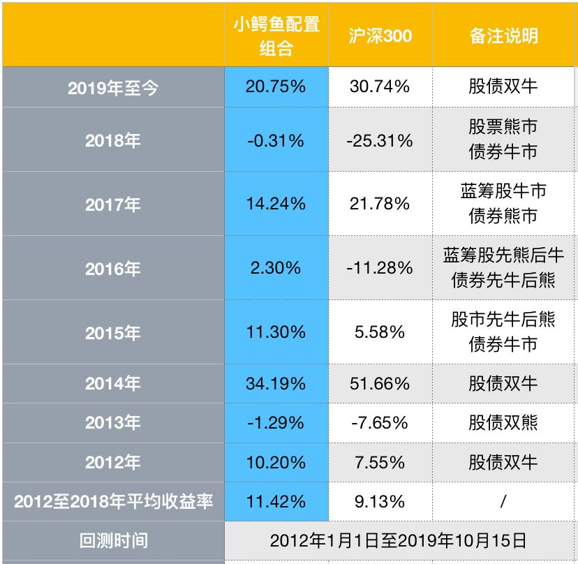

沈潜今天提到了他的[小鳄鱼配置组合](https://mp.weixin.qq.com/s?__biz=MzIwNzM0NTgzMw==&mid=2247489009&idx=2&sn=37fb44b1022528753278b2f758f2670b&scene=21#wechat_redirect)，并对它进行了回测，从历史波动情况来看这个实盘的波动和收益情况。在链接中，还有他对3只债券基金的分析，我周末的时候要好好研究一下。

> 过去的7年中，上证50有一半的时间处于熊市，一半时间处于牛市，债市的牛熊周期，也经历了好几轮。这也意味着，我们的回测数据，对于未来的收益率，有较高的参考价值。
>
> （我看了这个回测数据，还是蛮吃惊的，一个以债券为主的实盘组合，竟然也有10%的年收益率，看来我低估了债券的收益能力。我最近在看聪明的投资者，茨威格在点评时，也指出了西格尔教授在股市长线法宝中测算数据的瑕疵。我才慢慢转变对债券的偏见。看到这个回测数据后，我还是要好好研究一下债券市场了。这可以先从沈潜推荐的文章，还有3支债券基金的公告中学习。）

我这几天注意到，长电的股价一直在下跌，准备入手了，但是在犹豫中，看到沈潜的回复后，心里有底了，还是继续耐心等待机会。

> 沈大，请教长江电力近期发了几个公告，股价连续下跌。您对长江电力的看法和预期有改变吗？
>
> 没有

> 沈大，长江电力开始有所回调，你怎么看
>
> 还是按照原计划行事。

> 沈老师，长江电力现在改成17块以下分批买了吗，记得以前是17.71啊，最近调整的吗
>
> 因为之前分红过一次啊，除权之后就是17元了，已经改了好几个月了。
>
> （我想投资股票，连除权前后需要调整买入价格都不知道，怎么买。短期内，还是跟着靠谱的人投资再说；长期来说，还是要自己来学习和积累经验。）

> 请问二级债基的买入时点应该如何选择呢？
>
> 结合债市、股市的综合情况，进行判断，判断时，债市的权重要高于股市。
>
> （股市和债市都牛的时候，我就持有货币基金了。我对债市和股市的认识，还没有摸着皮毛呢，得抓紧时间学习才行。那是不是要入沈潜的星球了，这样效率会更高一些。不过，最终还是要靠自己的能力，这也是我认为投资很公平的一个地方。）