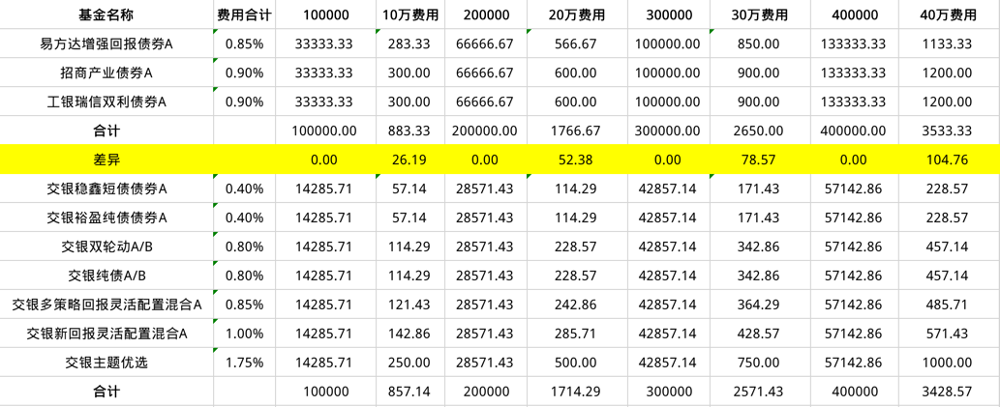

先记录下沈潜的投资心得

> 1、最开始做投资的时候，我觉得，投资就是比拼信息收集能力，又过了一段时间，我觉得，投资比拼的是信息的分析能力，总有一些让人意想不到的机会出现，现在，我觉得，投资最终比拼的，是我们对自我、对价值和对世界的认知与理解，信息的收集与分析，当然也是必要的，但最重要的还是深度思考的能力。
>
> 2、在古代战争中，对于粮草、兵力占绝对优势的一方而言，最理性的选择，并不是立即开战，而是以逸待劳、围而不打，当对手粮草消耗干净时，便会内乱，这时候，再出手，取胜便如探囊取物一般。投资也是一样的道理，不急着赚钱，才能赚钱。
>
> （是的，我最近越来越感觉到现金的重要性，正在收缩战线，连稳稳的幸福都暂停定投了。不确定的情况下，或者是没有好机会的情况下，保留现金都比瞎投要好。）
>
> 3、对于贵州茅台来说，最重要的财务指标，既不是营收，也不是利润，而是茅台酒的基酒产量和出厂价，其他财务数据，都是这两个指标的衍生品。
>
> 4、机场和互联网公司一样，本质上都是流量生意，先通过基础设施来吸引客流，然后再进行商业化变现，变现方式有很多，比如免税店分成、餐饮、广告等等。机场的商业效益，又取决于两个因素，一是，客流质量，这由其区位决定，国际旅客占比越高越好；二是，自身的经营效率。
>
> （我会研究一下上海机场，还有白云机场，可能有长线的投资机会。）
>
> 5、大多数人应该在职场收入达到天花板后，再去考虑做副业，对我个人而言，性价比最高的副业就是做投资：不需要大额固定资产投入、不需要依赖他人、时间越久越吃香……
>
> 6、我的一个经验：你能不能赚钱，与市场涨跌的关系并不大。行情好时，许多人所说的赚钱，只能说是**赚过**，一旦行情转差，不仅利润会还回去，还要搭上本金。经历过2007年、2009年、2015年股市行情的人，应该对此都深有体会。
>
> 7、如果非常熟悉美股历史的话，我们会发现，这些年来，国内股市的很多怪现象，当年在美股都发生过，而且更为夸张。美国股市的历史，对于我们在国内做投资，是很有参考价值的，再次建议大家读一本书：《伟大的博弈》。
>
> 8、用长期资金，以合理或低估的价格，买入优质资产，哪怕经历股灾等极端行情，最终肯定是会赚钱的。

中午吃饭的时候，联想到格雷厄姆和沈潜讲的，投资不是看本金，而是知识、能力和性格。我领悟到可能是这样的。钱再多，没有这三样本领的话，一样会糟蹋完的。钱再少，只要有这三样本领，也能成事。就像大空头中的那两个小伙子，车库里11万创业，终成3000万。但是一不小心，3000万也可能就打了水漂了。

今天我也测算了稳稳的幸福持有成本，作比较的对象就是沈潜的小鳄鱼配置中的债券组合。对比管理费用和托管费，小鳄鱼要多出一些。

假定投资10万元，每年的这些费用相差不多，也就不到30元；到了40万时，费用就体现出来了，一年要多出100元呢。不过这些相对交易成本来说，都是小钱。

假设我有40万，稳稳在调仓的时候，5万买入交银主题优选。它的申购费用是1.5%，按1折来算，就是75元。又调了一次，5万买入交银纯债。它的申购费用是0.8%，按1折来算，就是40元。这两笔调仓费用加在一起，就把费用的差额给弥补了。7支基金在一年的时间内，调仓频率通常不止2次。即使是都调的是纯债基金，也超过80元的调仓成本。长期持有下来，调仓成本也有大几百了。这对收益也是一大侵蚀。

从费用来看，我还是倾向于小鳄鱼中的债券基金组合。而且，这里面一个纯债，一个一级债基，一个二级债基，很好地覆盖了债券基金，挺好的。如果想减少回撤和波动，我可以把易方达的二级债基替换为博时信用债券A/B（050011）。

在测算的过程中，我被基金的费用吓倒了。真没想到，如果投入20万，一年的费用将近2000元；如果增加到30万或40万，费用更多了。真的是要注意基金的费用，不然钱都被基金公司赚走了。怪不得资金量大的投资者会青睐ETF，原来是成本真的低啊，如果是0.2%的年费用，可以降低将近80%的费用呢。真的是省到就是赚到。看来我要好好研究ETF和股票了，只有这样，才能降低自己的持有成本。当然，要看准机会，不然会增加很多的交易成本。我现在小额买入场内的基金，实际上是不划算的，不过由于金额太小，所以不明显。以后金额大的时候，差异就出来了。