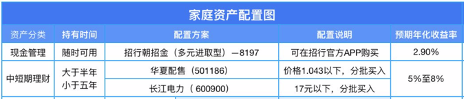
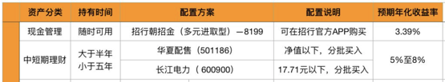

我今天买了500份华夏配售，单价1.045，共计522.5，溢价率是-5.78%。南方配售和易基配售的溢价率是-6.14%，但是我没有购买。之所以选择华夏配售，是因为当前它没有股票仓位，相对来说风险更小一些。这些战略配售基金原本是为互联网企业回归A股设立的，现在转到科创板上了。我对于近期科创板的炒作有点担心，所以还是安心持有债券。我第二天看到沈潜推荐的也是华夏配售，估计我与他选择的思路是一致的。

第二天（2019年9月3日）早上看到沈潜的文章，上面提到的建议是，价格在1.043元以下买入，分批买入

1.043比我的买入价格要便宜0.002元，算下来，我多花费了1元。我认为，这额外的1元钱，在我的承受范围内。最主要的是，超过5%的溢价率是我能够接受的安全垫。另外，在2019年6月17日，沈潜第一次发布家庭资产配置图时，给出的建议是，只要低于净值，就可以分批买入。这点也坚定了我继续买入的决心。

而且华夏配售在9月2日的溢价率，要远超过沈潜为家人配置时建议的2%的溢价率。

这么判断下来，继续买入是相对安全的，但是要做好长期准备，封闭期内估计不会有卖出的机会。

沈潜今天的文章中，有几个点我觉得很好：

> 我非常认同巴菲特的老师格雷厄姆在其名著《聪明的投资者》中，对于投资与投机的定义：
>
> 投资行为是建立在详尽分析基础之上，能够承诺本金安全和令人满意收益的行为，一切无法满足上述条件的行为都是投机行为。
>
> 所以，在买任何一只股票或基金之前，我总是会问自己，这笔交易，自己在哪些情况下会亏钱？
>
> 如果一笔交易，我无法确保，自己长期肯定不会亏钱，那么，这样的交易，我就不会参与，宁可错过，这个世界上的钱，是赚不完的，但会亏完。

最后一句，能够亏完，也让我警醒了，保持对市场的敬畏之心。

沈潜每天的文章中，还会分享一篇好文，只可惜我目前的时间不够，不能一一颀赏学习了。

在留言中，有人在问沈潜，最近港股低迷，是否有推荐的指数基金，而沈潜的回答很有意思：

>先生，之前您有定投的华宝香港大盘是不是已经转换了？我个人觉得近期香港股市比较低迷，尤其这基接近低点，是不是可以继续定投，因为比较看好后市的发展。不知先生怎么看这只基?
>
>这只基金我在7月2日时已赎回，相对于港股指数基金，我更看好港交所这一只股票。

我目前没有涉足股票的打算，先推测一下沈潜的思路。港交所上市公司市值在2019年已经进入前5，超过了伦敦和泛欧，更是把竞争者新加坡甩在身后了，上升趋势明显。而近期因为香港和大陆因为引渡法案的问题，影响了香港经济，进而波及了港交的的股价。长期向好，短期下跌，这正是长期投资者入手的时机。再加上，港交所也类似于平台，每年都会有源源不断的交易收入，像收租一样。这样来看，基本面也不差。

在-5%的溢价率以上，我会继续买入。关于溢价，这一点我一直不理解，为什么在场内外会有这么大的差价呢？如果是好机会，难道其他人就看不出来吗？是不是有卖出者认为的其他更好的机会，所以才选择折价卖出？

老钱在今天的文章中提到，他准备入手一些军工龙头，在国庆前赌一把，是不是近期大家都在炒作这些热点。即使是军工完全不能用估值来判断（这句话是哪篇文章中讲到的？）如果是这样的话，我更要预备好现金，在国庆之后大家准备离场的时候入场买筹码。

>今天上午看到军工涨了，顺手买了点儿军工指数，估值啊啥的一眼没看，纯粹追涨，博一下阅兵行情。
>
>考虑到阅兵之前肯定要卖，只拿几天，这种情况买场外指数基金就非常吃亏了。
>
>所以在场内买的军工龙头指数，只收万2.5的交易佣金，划算多了。

老钱也提到了中概互联和恒生指数。

>上一篇文章[《港股又跌出机会》](http://mp.weixin.qq.com/s?__biz=MzA5MDg0NjY0Mw==&mid=2649613580&idx=1&sn=1a9b055e2a9049a4038cd4cf1415d90c&chksm=881c21d0bf6ba8c696bbd17d369760583eebe9d1813e8bfb4fed80a9fa3533828bdd36f59d90&scene=21#wechat_redirect)里提到过的恒生指数和恒生国企指数，这个月说啥也得把底仓买起来。
>
>此外，中概互联指数也值得关注了。其实这个指数我一直都很喜欢，无奈主要成分股腾讯阿里的市场关注度太高，估值也贵。
>
>现在好了，两位老大哥的PE-TTM都降到了30多倍，百度的估值更是被杀得不像互联网企业了，只有16倍左右。
>
>价格都回到了相对合理的区间，举个例子：之前这一揽子股票是黄金资产，卖钻石价格。现在仍然是黄金资产，但价格正在回归。

我从上周开始定投中概互联场内基金，跟着沈潜的建议，准备跟下去了。

E大也讲了，150计划在23000点以下买入1-4份恒生，21000点以下买入4-10份恒生。S会在23000点以下持续买入。看来我又要准备一笔现金来入场了。

晚上看钉大，他还没提恒生指数，可能是觉得下跌的幅度还不够大吧。但是他讲到，创业板指已经高估了，PE到了45.88，股息率为0.5%，ROE为9.61%。我看了老罗的指数估值 ，创业板指的估值百分位到了59%，PB百分位到了52%。

也谈钱今天在讲他的调仓，我看了一下，其中有战略配售基金，就把这篇文章中的部分内容给截下来了。

> 下面说说我的调仓安排
>
> * 把手里的场内 **沪深300** 都换成 **兴全合宜**。
> * 把债券基金换成已经被遗忘很久的战略配售基金。
> * 开始定投港股恒生指数。

看到了也谈钱提到的兴全合宜，也准备入手一些。但是它的管理费是1.5%啊，这个真的有那么强吗？可能在A股这个不成熟的市场里，高人还是会轻松赚取额外收益的。E大不是了买了兴全的可转债吗，他也买了一些主动管理基金。我先观察一下再说，毕竟手里现金不多，要珍惜机会，不能乱投，还要保留足够的日常开支。

对于调仓的原因，也大也说明了。

>前两条调仓的关键词是场内折价 + 超额收益，受限于篇幅这里就不展开了，明后两天我会具体说说。别着急，这两个都是慢机会，跑不了的，因为吃到这个超额收益的前提是长线投资。大家都想着赚快钱，反而把这些长期的好机会留给了我们。
>
>港股恒生指数没啥好说的，又一次接近了低估区，很庆幸在牛市来临之前还能有不错的上车机会。虽然距离历史低估区还有点距离，但是定投已经可以开始了，抄底抄的是区间，不是点位。

这里提到的大家都想赚快钱，可能说是就是国庆前的这波行情吧。

在谈到调仓的时候，也大提到了他的资产配置，固定收益部分大概有20%。

> 留了这么大比例的固定收益仓位，完全是一个进可攻退可守的状态，永远有钱加仓，用 E大 的话说就是「非常舒服」。

看来最近要多准备一些现金了。好机会一下子就来了，而且现在还是上证2924点，3000点以下的安全区间内。我考虑了一下，年底还有4万元拍拍贷入账，最近手头可以先紧一下，抓住眼前的机会再说。

这又一次验证了：

> 市场缺的不是机会，是钱。

还有郑大的一篇文章，分析了ETF的格局，还有BETA基金。

先是宽基指数

>**宽基指数ETF**
>
>上证50是华夏基金的地盘；
>
>沪深300是华泰柏瑞、嘉实、华夏基金的地盘，易方达的（低费率）300ETF距离百亿还差十几亿规模；
>
>中证500是南方基金的地盘；
>
>创业板是易方达的地盘。
>
>宽基并非上述这四个，大家也都没有闲着：
>
>汇添富要占据中证800，并将其做大做强；
>
>广发基金要占据中证100，并将其做大做强；
>
>银华基金要占据MSCI，并将其做大做强；
>
>总之宽基市场已经是一篇火海了……

接着是行业/主题指数

>国泰的证券ETF是第一个规模上百亿的行业ETF；
>
>华宝的科技ETF是第一个上市三天就规模翻翻的ETF；
>
>华宝的科技ETF上市成功之后，目前还有好多科技100、研发100啥的就要迎面而来…… 
>
>华夏基金更是一次获批了几个行业/主题ETF，例如银行、证券、５G、地产、还有豆粕期货ETF，基本是要进行一场全面PK……其实大湾区、长三角、京津冀啥的地域主题ETF都是层出不穷。

最后讲了SmartBeta

>有人说聪明指数是介于被动与主动之前的指数基金，卖点就是它们可以跑赢传统指数基金。
>
>其实这样宣传，就如同说主动基金可以跑赢指数基金一样，但是最后有跑赢的，也有没有跑赢的，估计未来聪明指数基金的结果同样如此。
>
>其实望京博格认为，SmartBeta也Beta，是Beta就要打价格战…… 美国最大的聪明指数基金的费率也就是万5，比传统指数基金就多了万1，最大的传统指数基金是先锋集团的、最大的聪明指数基金也是先锋集团的……
>
>嘉实基金还为他们SmartBeta搞了一个品牌，叫做Super ETF，还有一个SmartBeta50人论坛，望京博格有幸也是成员之一，感谢嘉实基金。
>
>在SmartBeta方面突出的就是嘉实基金的基本面系列ETF、此外还有各家的红利、低波、价值、成长、动量等等因子的聪明指数基金，最近几年比较出名的就是景顺的500低波、银河的300价值、还有华泰柏瑞的红利……
>
>相比宽基指数、行业/主题指数的ETF战场相比，SmartBeta指数最大的特定就是品种多，每一个宽基都可以搞多个维度的SmartBeta指数…… 所以这个研究起来也挺费时间的。
>
>在ETF投资标的选择方面，做强做大的方法就是要挖掘大家都喜欢的标的（天时地利人和），或者换一个角度广种博收也是好方法，但是要求有经济实力。

他也提到了ETF的大V带量

> 一个客户在券商买卖某个ETF是因为券商为其提供投资研究服务吗？大概率不是，而是客户看了带有某些观点的文章进行投资决策导致。通常互联网上的文章都是所谓的大V写的。
>
> 券商研究所的服务对象都是机构投资者，所以券商研究所的文章也是普通小白看不懂的，例如PEG是啥，估计90%的ETF投资者都不懂，但是如果互联网大V用通俗的语言改写一遍就把阳春白雪变成下里巴人了。
>
> 现在最有效的是基金组合，例如E大、钉大、博格的基金组合，不仅跟投规模很大，而且机构投资者也关注。
>
> 例如，一个保险公司的组合基金经理跟我抱怨：
>
> “你说券商里面的基金研究员，连个实盘组合都没有，还给我推荐基金…… 我还不如把你的绿巨人组合优化一下呢……”
>
> 如果从基金销量而言，目前最大的互联网平台还是蚂蚁、天天、腾讯，当然大家也不要忽视了新锐力量蛋卷基金与且慢啊。
>
> 现在与未来都是互联网时代，做强做大的方法就掌握核心内容…… 目前核心内容的生产者都是网络大V了，预计未来大V带量的效果会愈发显著。

我就是看到了钉大的文章，才跟投了螺丝钉组合。我最近详细梳理了里面的基金，都是BETA基金，费用不低啊。我会保留这些仓位，继续进行观察。

对于E大，还有沈潜推荐的这些基金，我也会进行梳理。

经过梳理后，我会采用定期不定额的方式，结合这些大V对于市场的判断，来决定投资组合。

在看西雅图雷尼尔的一篇文章时，他提到了越南出口增长很快，但是没有产业链。他也提到了电商配套产业是一个机会。这句话我不明白。什么是电商配套行业。

>大家如果关心中国出口的话，中国这几年机械产品出口的比例越来越高。如果要把这样的企业，搬去越南，不是说不可能，就重新打造供应链这一项，就需要好多年。（提个醒，有实力的老板可以投资电商的配套行业，后面十年机会大大的有）